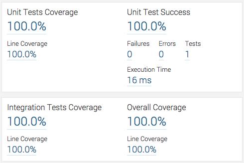

# jacoco-sonar-reference-impl
Maven failsafe plugin, Jacoco code coverage and Sonar reference implementation.

It is often tricky to retro-fit Jacoco code coverage into an existing multi-module maven project, particularly enabling the separate tracking of unit and integration test coverage. 

This reference implementation should make it clearer exactly what is required without any additional noise. 

<em>All of the required configuration is in the system-under-test maven modules' [pom.xml](system-under-test/pom.xml) file for reference.</em>

## Reference 
Further to Arnaud Héritier's excellent post ['Maven, failsafe, sonar and Jacoco are in a boat...'](http://www.aheritier.net/maven-failsafe-sonar-and-jacoco-are-in-a-boat/)

## System
Mac OS X 10.10.1

## Prerequisites

Sonar installed and running on MySQL on localhost. Please see the example [sonar-runner.properties](https://gist.github.com/aeells/96ede82d2b429a7a5d05#file-sonar-runner-properties) 
and [sonar.properties](https://gist.github.com/aeells/6e0c3d3dab551cd20e1a#file-sonar-properties) files.
 
```$ brew install mysql sonar sonar-runner```

```$ vim /usr/local/Cellar/sonar-runner/2.4/libexec/conf/sonar-runner.properties```

```$ vim /usr/local/Cellar/sonar/5.0/libexec/conf/sonar.properties```

```$ sonar console```

## Usage

```$ mvn -B clean verify -pl system-under-test -Pcoverage```

```$ mvn -o sonar:sonar -pl system-under-test```

## Result

Browse to [localhost:9000](http://localhost:9000) and if you have added the 'Integration Tests Coverage' widget to the dashboard you should see separate unit and integration test results.


